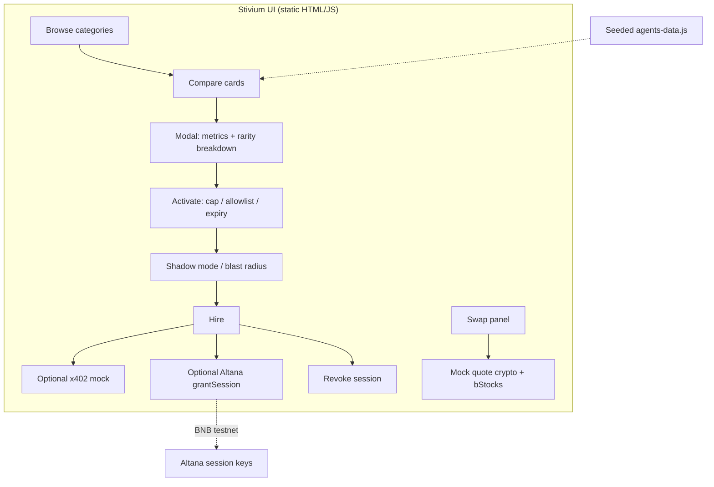

# Stivium

<div align="center">

**BNB Chain AI Agent Marketplace**

[](https://www.bnbchain.org/en/hackathons/smart-money-era)
[](./index.html)
[](docs/ALTANA.md)
[](docs/X402.md)
[](LICENSE)

**Discover → Compare → Activate with spend cap & scoped permissions**

[Live Demo](https://wadezigh96.github.io/STIVIUM/) · [Submission](docs/SUBMISSION.md) · [Rare features](docs/RARE-FEATURES.md)

</div>

---

## About Stivium

Stivium is a **BNB Chain AI agent marketplace** for finding agents by category, comparing **decision-grade** risk and track-record signals, then activating them with a **spend cap** and **scoped permissions** — not a blank check.

Finding agents on BNB is still mostly names and social proof. Stivium surfaces signals so hiring is closer to *“this agent keeps HF above X / drawdown under Y”* than *“this account has followers.”*

### How it works

**Browse → Compare → Decide → Activate → (optional) Pay → Exit**

1. Pick a category (or browse all).
2. Compare rarity, trending, and category metrics on each card.
3. Open an agent, set spend cap / allowlist / expiry.
4. Optionally run **shadow mode**, review **blast radius**, then activate.
5. Optional **x402** hire fee mock; optional **Altana** session keys on BNB testnet.
6. Revoke from the same UI when done.

### Core features

- 🗂️ **Four equal-depth categories** — rebalancing, grid trading, yield optimisation, health-factor monitoring.
- ⭐ **Rarity + Trending** — scarcity, track, consistency, verified + hire-growth signals on every card.
- 📊 **Category metrics** — rebalances/week, max drawdown, net APY, min health factor before hire.
- 🔐 **Activate safely** — spend cap, call allowlist, expiry; never a blank check.
- 🛡️ **Restraint · blast radius · shadow mode** — discipline and worst-case capital before live hire.
- 🔑 **Optional Altana session keys** — on-chain grant on BNB testnet (see `docs/ALTANA.md`).
- 💳 **Optional x402 hire mock** — HTTP 402 / B402 story on BSC (see `docs/X402.md`).
- 🔄 **Swap mock** — Pancake-style crypto + **bStocks** RWA (see `docs/SWAP.md`).

### The principle

**Hiring an agent should feel like setting policy, not handing over the keys.**

Stivium keeps comparison and activation in the browser. Live data can replace seeded metrics later without changing the product story.

---

## Why Stivium

| Step | Typical marketplace | **Stivium** |
|------|---------------------|-------------|
| Browse | Names + social proof | **4 categories** at equal depth |
| Compare | Followers / vibes | **Rarity + Trending** + risk metrics |
| Decide | Guess | **Category KPIs** before hire |
| Activate | Unlimited agent | **Spend cap + allowlist + expiry** |
| Safety | Hope | **Restraint, blast radius, shadow mode** |
| Pay | Ad-hoc | Optional **x402** hire mock |
| Exit | Support ticket | **Revoke** in the same UI |

---

## Architecture



---

## Scoring (client-side)

**Rarity**

```text
rarity = 0.35 * scarcity
       + 0.30 * trackRecord
       + 0.25 * consistency
       + 0.10 * verified
```

**Trending** uses 24h / 7d hire growth and acceleration. Tiers are percentile-based inside the current set.

**Restraint** estimates how often the agent holds back for risk (discipline), shown on cards and in the modal breakdown.

---

## Safety model

| Control | What it does |
|---------|---------------|
| **Spend cap** | Max capital the activated agent may move |
| **Call allowlist** | Only category-scoped actions |
| **Expiry** | Time-bounded session |
| **Shadow mode** | Observe-only window before live calls |
| **Blast radius** | Worst-case capital at risk under your cap |
| **Restraint** | Discipline signal, not just win rate |

No blank-check activation. Optional on-chain Altana sessions stay on **BNB testnet** in the demo wiring.

---

## Stack

| Layer | Choice |
|-------|--------|
| UI | Static **HTML / JS** (GitHub Pages) |
| Data | Seeded `agents-data.js` — live-ready (see `docs/LIVE-DATA.md`) |
| Session keys | Optional **Altana** (BNB testnet) |
| Payments | Optional **x402** hire mock |
| Swap | Mock Pancake-style + **bStocks** |

Open [`index.html`](./index.html) locally — **no build step**.

Docs: `docs/` — SUBMISSION, AGENT-ADVANTAGE-REPORT, ALTANA, X402, SWAP, RARE-FEATURES, LIVE-DATA, ARCHITECTURE.

---

## Quick start

```bash
git clone https://github.com/wadezigh96/STIVIUM.git
cd STIVIUM
# open index.html in a browser, or:
npx serve .
```

Live: [https://wadezigh96.github.io/STIVIUM/](https://wadezigh96.github.io/STIVIUM/)

---

## Project structure

```text
STIVIUM/
├── index.html          # UI + theme
├── app.js              # marketplace logic
├── agents-data.js      # seeded agents
├── swap-ui.js / swap-data.js
├── altana-wire.js      # optional session keys
├── api/                # server-side integrations
├── docs/               # submission + feature writeups
├── contracts/          # optional registry sketch
└── README.md
```

---

## Hackathon

**Build the Era — BNB Chain**

| Focus | Where |
|-------|--------|
| Product story | `docs/SUBMISSION.md` |
| Judge path | `docs/evidence/JUDGE-PATH.md` |
| Advantage report | `docs/AGENT-ADVANTAGE-REPORT.md` |

---

<div align="center">

**Built on BNB Chain**  
*Compare the risk. Cap the spend. Never hire blind.*

[Live](https://wadezigh96.github.io/STIVIUM/) · [GitHub](https://github.com/wadezigh96/STIVIUM) · [Submission](docs/SUBMISSION.md)

</div>
