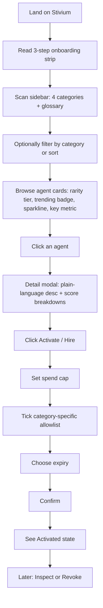

# User Journey

## Happy path (first-time visitor)

## Filter & compare path

1. User selects **Yield Optimisation**.
2. Sidebar shows count and average success for that category.
3. User sorts by **Rarity** → Legendary / Epic agents float to the top.
4. User opens two agents side-by-side (sequential modals) and compares:
   - Net APY (category metric)
   - Track-record component of rarity
   - 7-day hire momentum
5. Chooses the one whose risk/return profile matches their needs → activates.

## Empty / edge states

- Filter yields zero agents → clear empty-state message (“try a different category or sort”).
- Unknown term → glossary in sidebar (Rarity, Trending, Spend Cap, etc.).
- Already activated agent → badge visible; modal offers Revoke.

## Design principles behind the journey

- **Zero prior knowledge required** — onboarding + glossary + plain-language descriptions.
- **No dead ends** — every path either succeeds or explains why it is empty.
- **Decision support over decoration** — every number shown has a reason to exist (scarcity, momentum, category-specific outcome).
